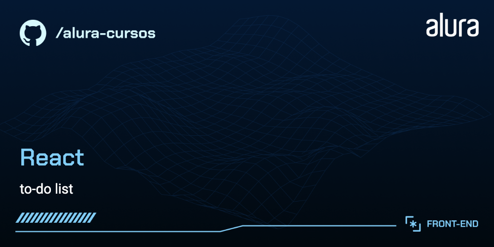

# App de Checklist de Estudos

Ao longo do curso, criamos um app de checklist para organizar estudos, tarefas e o que mais precisar.

## 🔨 Funcionalidades do projeto

* Adição, edição e exclusão de tarefas
* Organização das tarefas em "Para estudar" e "Concluído"
* Marcação de tarefas como concluídas
* Feedback visual para lista vazia (empty state)
* Modal para adicionar/editar tarefas
* Lista animada de tarefas


## ✔️ Técnicas e tecnologias utilizadas

O desenvolvimento do projeto aborda as seguintes técnicas e tecnologias:

* **useState e useEffect**: Gerenciamento de estado e persistência no localStorage
* **useContext**: Contexto global para compartilhar estado das tarefas
* **Componentização**: Componentes reutilizáveis como Button, FabButton, Dialog, TodoForm, TodoItem e TodoGroup
* **Estilização com CSS Modules**: Organização dos estilos por componente
* **Manipulação de formulários controlados**
* **Persistência local com localStorage**: Salva as tarefas mesmo fechando o app
* **Ícones SVG personalizados**
* **Boas práticas de organização de código**

## 🛠️ Como rodar o projeto

Após baixar o projeto, siga os passos abaixo para executar localmente:

1. Certifique-se de que você já tem Node.js instalado ([guia oficial](https://nodejs.org/en/download/)).
2. No terminal, navegue até a pasta do projeto e instale as dependências:

```bash
npm install
```

3. Execute o projeto:

```bash
npm run dev
```

4. Acesse no navegador: [http://localhost:5173](http://localhost:5173) (Vite).

## 🔗 Deploy

https://to-do-list-react-sepia-pi.vercel.app/